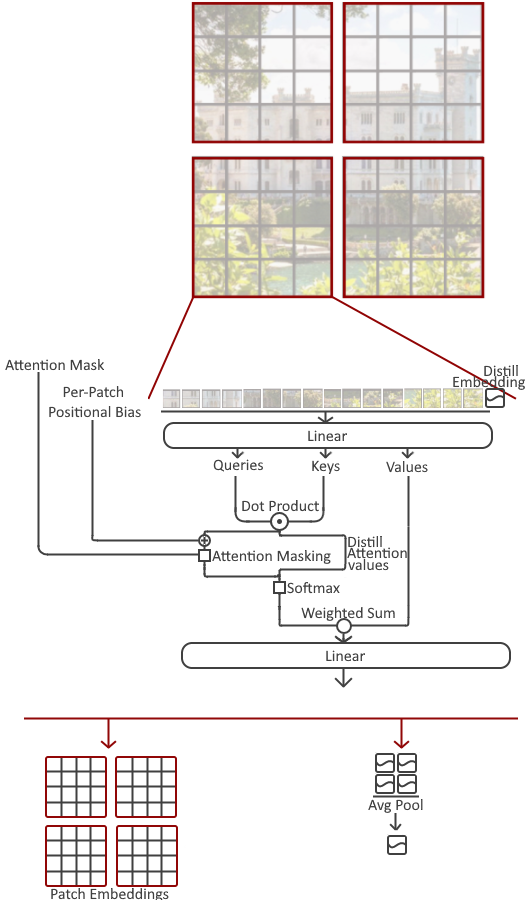
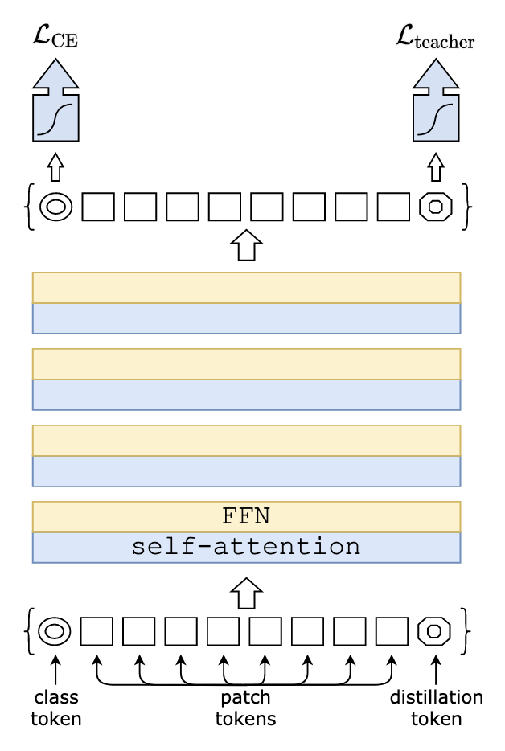
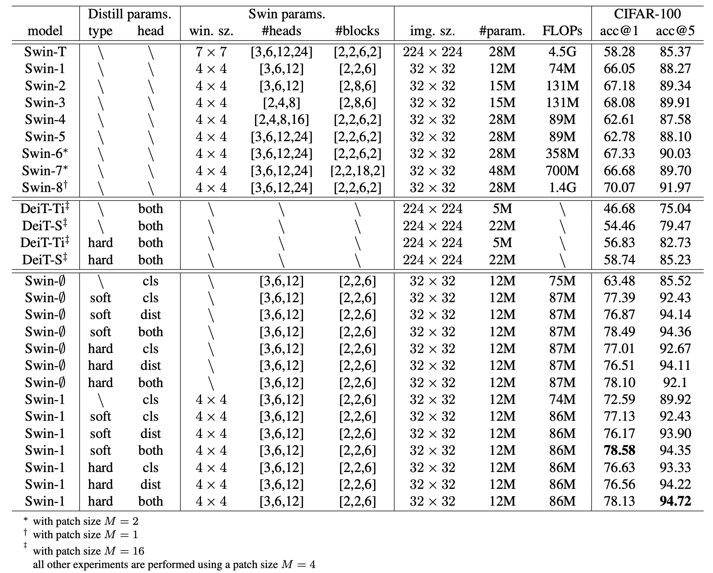
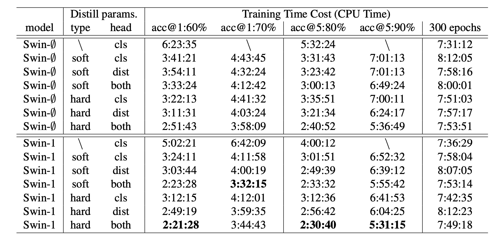
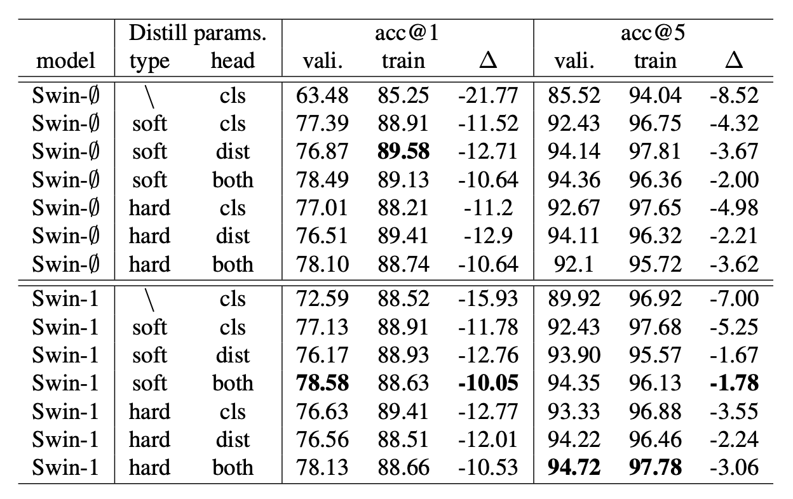

# Data Efficient Swin Transformer

## Introduction

**Swin Transformer** is initially described in [Liu, et al.](https://arxiv.org/abs/2103.14030), which capably serves as a general-purpose backbone for computer vision. It is basically a hierarchical Transformer whose representation is computed with shifted windows. The shifted windowing scheme brings greater efficiency by limiting self-attention computation to non-overlapping local windows while also allowing for cross-window connection.

**DeiT** is proposed by [Touvron, et al.](https://arxiv.org/pdf/2012.12877), which introduced a a teacher-student strategy specific to transformers, hence to enable a more efficient attention-based mechanism for vision tasks by applying knowledge distillation .

**Our work** combines the two mechanisms described above and achieves a desired result.


<!--  -->
 


## Usage
Please follow the instruction in `get_started.md` for enviornment and data preparation.

Trained models from the results of Swin + DeiT are available in trained_models, and can be loaded and evaulated as, for example:
```bash
python -m torch.distributed.launch --nproc_per_node 1 --master_port 12345 main.py \
    --cfg trained_models/CIFAR100_long_cosine_scheduler_hard_distill --output trained_models/CIFAR100_long_cosine_scheduler_hard_distill \
    --opts EVAL_MODE True \
```


## Result





<!-- ---
Trained models using Swin Transformer only, `.yaml` file that record hyper-parameters are provided in the `configs` folder. All hyper-parameter setting of the experiment in our report can be find in the folder:

```bash
python -m torch.distributed.launch --nproc_per_node 1 --master_port 12345 main.py \
    --cfg configs/swin_32x32_modify.yaml --batch-size 128 --output output/CIFAR100 \
    --accumulation-steps 2 --cache-mode part \
    --opts SAVE_FREQ 10 PRINT_FREQ 1 TRAIN.EPOCHS 200 DATA.DATASET cifar100 &>> output/CIFAR100/Swin_32x32_0_60.log
```

Train from checkpoint from `checkpoint_file_path.pth`:

```bash
python -m torch.distributed.launch --nproc_per_node 1 --master_port 12345 main.py \
    --cfg configs/swin_32x32_modify.yaml \
    --resume "{checkpoint_file_path.pth}" \
    --batch-size 128 --output output/CIFAR100 \
    --accumulation-steps 2 --cache-mode part \
    --opts SAVE_FREQ 10 PRINT_FREQ 1 TRAIN.EPOCHS 200 DATA.DATASET cifar100 &>> output/CIFAR100/Swin_32x32_61_200.log
``` -->
